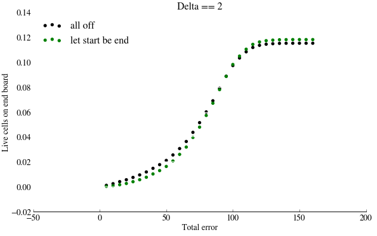
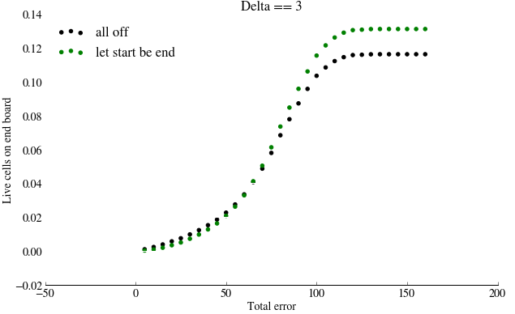
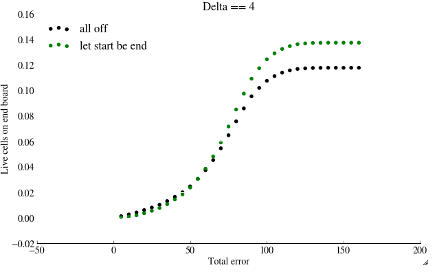
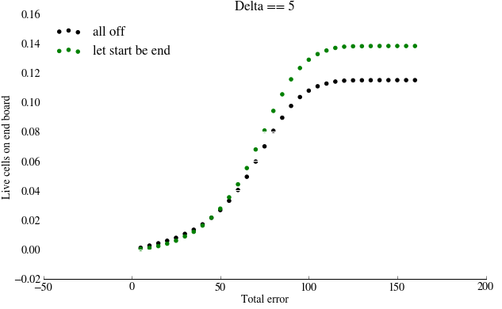
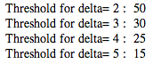

[TITLE]
========================================================
The Game of Life
========================================================

Kaggle - Can we predict Life in reverse?
-------------------------------------------------------
What we did?

We first realized that for cases where delta was equal to 1, the heuristic of letting all start boards just equal the end boards did a very good job. For these isolated cases our error was around 0.116957. From here we tried applying the same heuristic to cases where delta was greater than 1. Sadly letting the start board equal the end board performed worse than did the simple all off heuristic. 

We then decided that perhaps there existed a threshold -- of live cells alive on the end board -- where below the threshold the heuristic of letting the start board equal the end board performed better than the all off heuristic, and above the threshold the all off heuristic performed better than start equal end heuristic. We investigated the total errors of using both methods and found that in general with 'few' living cells on the end board, it was better to use the start equal end heuristic. Specifically we plotted the total error against the number of living cells and we were able to come up with a threshold for each delta.





So essentially we found the threshold by finding where the differential between 'all off' heuristic error and 'start equals end' heuristic was the greatest, or:
$$max(aoff-startEqEnd)$$ where $$aoff $$ is the all off heuristic and $$startEqEnd $$ is the start equals end heuristic. We found the number of living cell index that correlated with this maximum differential. The idea behind this is rather simple. Starting from living cells equals 0, the two curves (all off error and start is end error) begin to diverge. This divergance is explained by one heuristic performing better than the other (ie start equals end). Then comes a point where they begin to converge. At this point the roles flip and the all off heuristic starts to perform better than the start equals end. Here is a reading of the thresholds we found. (Note: there is no threshold for detla==1 because it is always better to use the start equals end heuristic when delta is 1).





Submitting a solution!
-------------------------------------------------------
```{r eval=FALSE}
test <- read.csv("test.csv",stringsAsFactors=FALSE)

## Predict board 
test.out <- as.matrix(test[,3:402])
delta <- test[,2]
for(i in 1:nrow(test)){
  if(i%%100==0){ print(i) }
  
  ## predict board takes a board (as a vector) and the number of steps backward to predict
  ## and returns a the predicted board
  test.out[i,] <- predictBoard(test.out[i,],steps=delta[i])
}

## Add board id's and make sure column names match the requirements
test.submission <- cbind(test$id,test.out)
colnames(test.submission) <- c("id",colnames(train)[grep("start",colnames(train))])
write.csv(x=test.submission,file="exampleSubmission.csv",row.names=FALSE)
```

